# ANOTE Mobile — Architecture Overview

> Medical dictation app for Czech doctors. Records speech, transcribes it (on-device or cloud), generates structured medical reports via LLM.

---

## 1. High-Level System Architecture

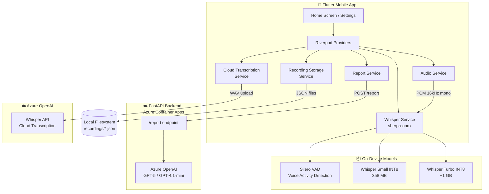

---

## 2. Recording → Report Pipeline

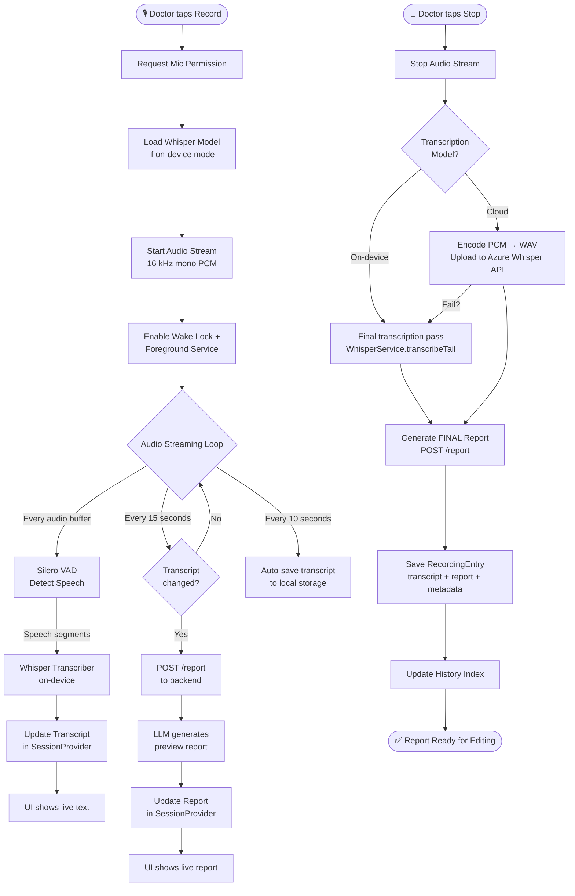

---

## 3. Module & Service Structure

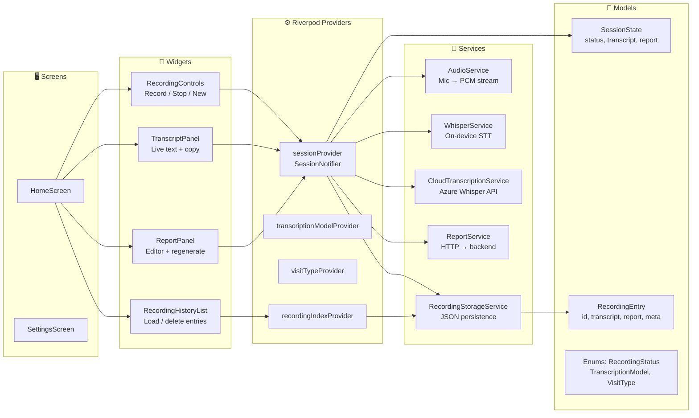

---

## 4. Transcription Modes

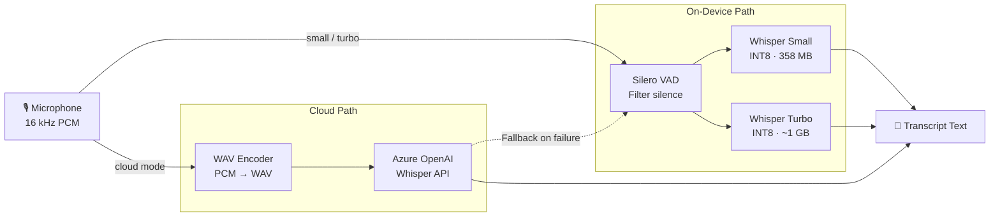

| Mode | Size | Internet | Speed | Use Case |
|------|------|----------|-------|----------|
| **Small** | 358 MB | ❌ No | Good | Default, works offline |
| **Turbo** | ~1 GB | ❌ No | Better | Higher quality offline |
| **Cloud** | — | ✅ Yes | Fast | Best accuracy, needs connection |

---

## 5. State Management (Riverpod)

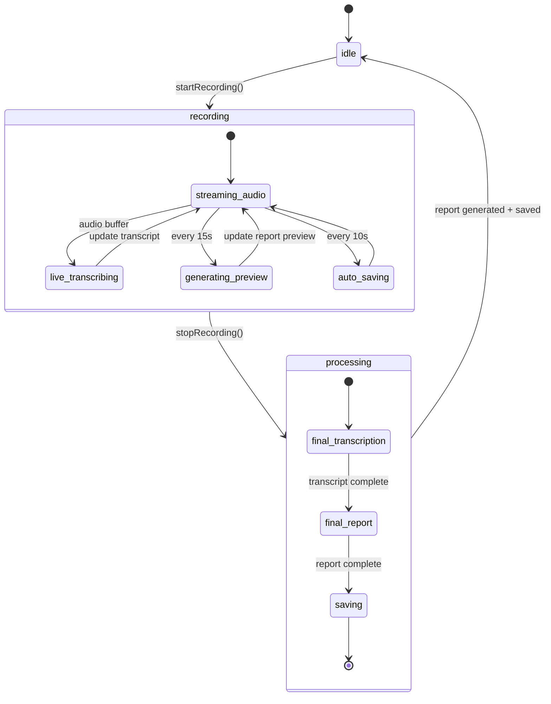

### Provider Dependency Graph

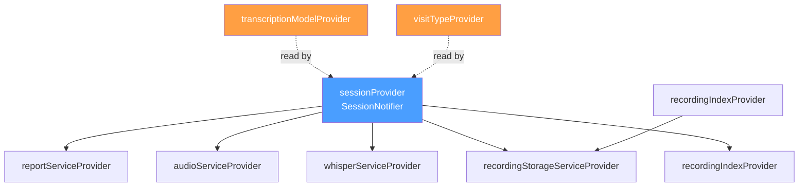

---

## 6. Backend API & Report Generation

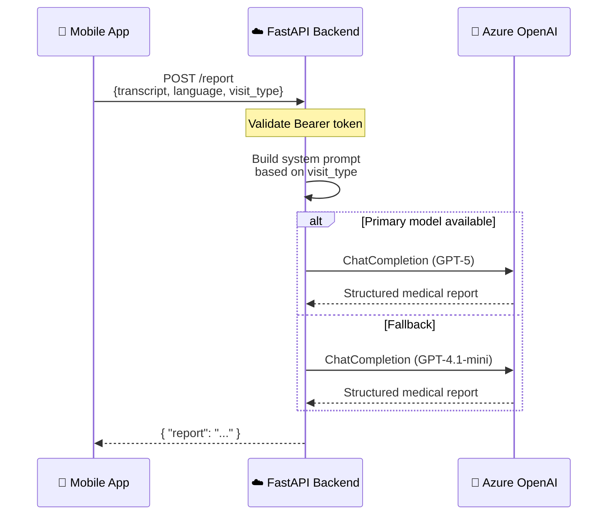

### Visit Type → Report Template

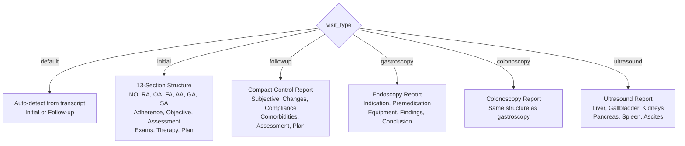

---

## 7. Data Persistence & Storage

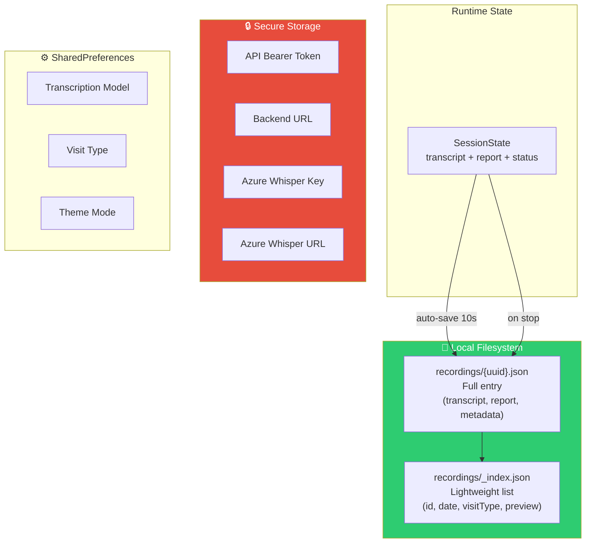

### Storage Safety

- **Atomic writes**: write to temp file → rename (prevents corruption)
- **Index auto-rebuild**: if `_index.json` is corrupted, scans all `*.json` files
- **No audio stored**: only text (transcript + report) — GDPR-friendly
- **Sorted newest-first**

---

## 8. UI Layout

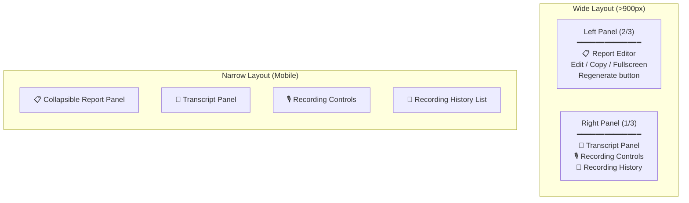

### Navigation

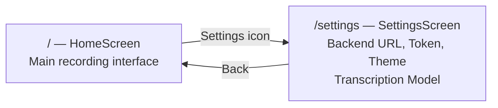

---

## 9. Key Technology Stack

| Layer | Technology |
|-------|-----------|
| **Framework** | Flutter (Dart) |
| **State** | Riverpod (StateNotifier) |
| **Audio** | `audio_streamer` (16 kHz PCM) |
| **On-device STT** | `sherpa_onnx` (Whisper INT8 + Silero VAD) |
| **Cloud STT** | Azure OpenAI Whisper API |
| **HTTP** | `dio` |
| **Storage** | JSON files (`path_provider`) |
| **Secrets** | `flutter_secure_storage` |
| **Background** | `flutter_foreground_task` + `wakelock_plus` |
| **Backend** | FastAPI (Python) on Azure Container Apps |
| **LLM** | Azure OpenAI (GPT-5 → GPT-4.1-mini fallback) |
